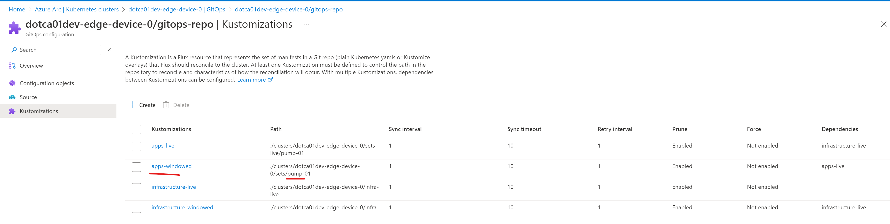
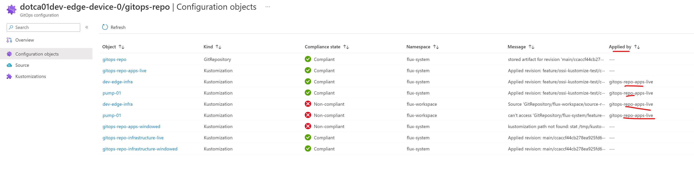

# Creating Flux Kustomizations in IaC

## Context

Flux Kustomizations can be created and configured in IaC in a variety of ways, including:

1. Adding the flux commands in a cloud-init script.  But then every time you need to make a change, you need to log into the server and re-run the script. (Or rebuild the server).

2. [In terraform](https://learn.microsoft.com/en-us/azure/templates/microsoft.kubernetesconfiguration/2022-01-15-preview/extensiontypes?pivots=deployment-language-terraform) with [Azure Arc Flux extension](https://learn.microsoft.com/en-us/azure/azure-arc/kubernetes/conceptual-gitops-flux2) when the device is provisioned.

   However, the extension uses the [Azure REST APIs](https://learn.microsoft.com/en-us/rest/api/azure/) [Flux Configurations endpoint](https://learn.microsoft.com/en-us/rest/api/kubernetesconfiguration/flux-configurations/create-or-update) to configure Flux.   That endpoint only supports a limited number of Flux `kustomization` parameters, as seen [here](https://learn.microsoft.com/en-us/rest/api/kubernetesconfiguration/flux-configurations/create-or-update?tabs=HTTP#kustomizationdefinition).

    This means that a number of features within the `kustomization` resource are not configurable via the Arc Flux extension, such as [variable substitution](https://fluxcd.io/flux/components/kustomize/kustomization/#variable-substitution) and [health assessment](https://fluxcd.io/flux/components/kustomize/kustomization/#health-assessment), the latter being a requirement of using the [notification provider](https://fluxcd.io/flux/guides/notifications/).

Given the drawbacks of each approach, how can we create & configure Flux Kustomizations which support features such as health checks variable substitution, whilst also providing visibilty of the status of kustomizations.

 

## Solution

The solution is to use a "bootstrap Flux kustomization" - i.e. an initial Flux kustomization which points to a single folder of the GitOps repo where other Flux Kustomizations can then be defined.

> i.e. A single Flux kustomization watches a folder which defines other Kustomizations.

This first Flux kustomization can be defined in Terraform.  Future Kustomizations defined within the GitOps repo itself will not be subject to the Azure Arc API limitations (mentioned above).

 

## Results of Flux kustomization testing

### Are manual changes to Flux Kustomizations created via the Azure Arc extension overridden?

**Test protocol**

1. Create a simulated edge device via IaC. The terraform creates four Flux `kustomizations` via the Azure Arc extension
2. Edit one of those Flux Kustomizations, `gitops-repo-apps-windowed`, change `.spec.path` from `./clusters/edge-device-0/sets/set-01` to `./clusters/edge-device-0/sets/set-01/test`

**Result**

After 48h+ the change is still present. However, the change is not reflected in the Kustomizations blade on the Azure portal:

### Can a Flux Kustomization install more Flux Kustomizations?

**Test protocol**

1. Create a simulated edge device via IaC. The terraform creates four Flux kustomizations via the Azure Arc extension.
2. Change one of the Flux kustomizations, `gitops-repo-apps-live` so that `.spec.path` points to clusters/<cluster_name>/flux

**Result**

The new Flux Kustomizations from `/clusters/device-name/flux` are installed onto the cluster. Those Kustomizations are also picked up by the Flux controller, and new resources are installed into the cluster based on those new Flux `kustomizations`.

### Are Flux Kustomizations that are manually installed onto the cluster visible on the Azure portal?

**Test protocol**

Follow steps from the [previous test](#can-a-flux-kustomization-install-more-flux-kustomizations).

**Result**

The new Flux `kustomizations` are present in the Azure portal, on the gitops view, in the *'Configuration objects'* blade:

Even the `kustomizations` from the `flux/` folder are shown. The new `kustomizations` seem to work in a similar manner as Azure Arc installed ones in this view.

The new `kustomizations` are however **not** shown on the *'Kustomizations'* blade.

### Can you stop Flux kustomization changes to be overwritten by the state in the `flux/` folder?

**Test protocol**

1. Create all kustomization resources using the bootstrap customization
2. Manualy suspend maintenance window kustomization using `kubectl` or `flux cli`.
3. Check if the added suspend value will be removed by the bootstrap kustomization.

**Result**

After waiting for up to 1h the `suspend` key has not been removed from the kustomization.

Flux seems to use a "merge" behavior when updating the kustomization resources.
Unless the parameter `suspend` is set in the manifests created by ConfigService, it will not be overwritten by flux. This behavioure is true, even if it is changed/added manually on the cluster.
Although we are not setting the `suspend` in the generated manifests, to preemptively prevent overwrites, we can label all maintenance window kustomization resources with `kustomize.toolkit.fluxcd.io/reconcile=disabled`. This label will prevent the resources to be reconciliation by flux.
During the maintenance window, the label can be overwritten with `kustomize.toolkit.fluxcd.io/reconcile=enabled`, so that potential changes to the kustomization manifest can be reconciled.

