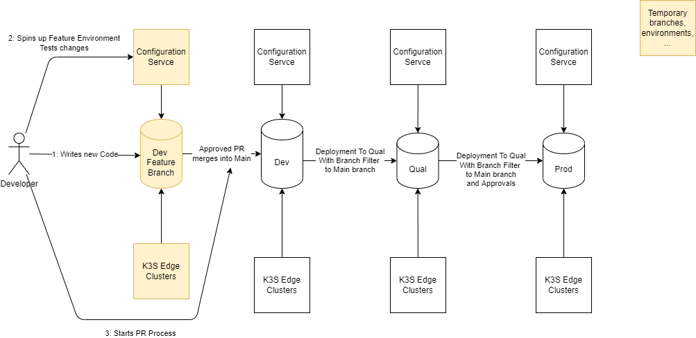
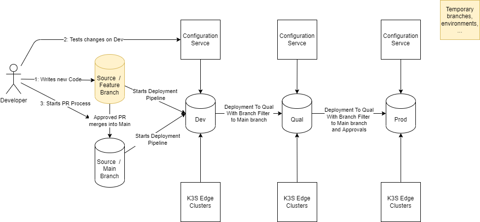

# Promoting changes to Environments using GitOps Repositories

## Problem
How to structure GitOps repositories for different environments and how to promote changes from dev to quality to prod?

## Foundation, Requirements and Constraints 
- Based on the ADR [GitOps: Representation of Environments](./GitOpsEnvironments.md)
- Ensure that we can promote changes between different repositories that are each linked to an environment
- Ensure that only changes to selected folders are promoted
- Support a workflow where developer can work in a feature branch, test changes from this feature branch on a dev environment, close the development with a PR with triggers build pipeline that can deploy this changes to the dev environment and afterwards to qual and prod environments.
- We want to preserve the relevant history on the environments GitOps Repo.
  - This may include only a version reference and release notes
  - Or a full git history of the development.
- Branch filters/policies should be used to ensure that feature and main branches can be deployed to dev and hotfix and main branches can be deployed to all environments.

# Options:

## Environment Repositories with feature branches
There are 3 different repositories: Dev, Qual, and Prod.
All development is done on dev in feature branches, open a PR and merge to main. The changes are then deployed with pipeline(s) to the different environments.

The setup could look like this:

- Only two pipelines or pipeline steps are needed to promote from dev to qual and from qual to prod.
  - And it is easy to ensure that changes are only moved without skipping an environment
  - Or use a pipeline/release approach as describe in "Source Repositories and Environment/Deployment Repositories"

### Challenges:
- How to test changes from the feature branch?
  - Edge devices track the `main` branch of the dev repository, there would need to be a way to reconfigure edge devices to track changes from the feature branch.
  - If any additional services, like a Config Service, is used, those will also track `main` by default, and will need special considerations.
  - Dynamic environments spun up from the feature branch would solve the issue neatly, but may be infeasible to implement.

- How can we ensure that only changes from Infra and Apps folders are promoted?
  - The pipeline can ensure that only these folders are copied and pushed to the next environment.
- How can we ensure a clean git history if this repository is used for dev environment configuration changes and development changes? 

## Source Repositories and Environment/Deployment Repositories
In addition to the three environment repositories, a fourth repository is used as the source GitOps configuration repository. The source repository is used in a similar manner as an application source repository, where the deployment files are developed. That code/configuration is then deployed into the various environment repositories as needed. It also distributes the responsibilities of the dev git ops repo to two independent repositories: one that are used to test and apply changes in dev (the dev environment repository) and one repository that is used to support the development process with branch policies, linked work items and a clean git history (the gitops source repository).

This can be implemented with the following setup:

- In this setup tests on dev are easy to start as each push to a feature branch gets deployed to the dev environment. Parallel development on dev could still create demand for different environments.
- All environments are configured and setup the same way

# How could a deployment look like (works for both alternatives):
  - A pipeline could select the folders apps and infra and create a deployment zip (includes all sub folders and files, without git files)
  - A release could organize the deployment of this zip to the different environments
    - In this way we get the good overview of releases and can in addition customize the git commit to ensure we have a easy to read message.
    - The combination of releases and pipeline makes it easy to link changes to a user story 
    - We can ensure that all stages get the same changes, and only changes to Apps and Infra Folder are promoted

- How will the pipeline work? 
  - [ ] Fork / Upstream branches or copy/paste?
  - [ ] Commits to main or PR for each environment?
  - [ ] How much of the git history is important to be available on prod?
  - [ ] Should it be possible to remove files from the Apps and Infra folders?

# Related questions
- [ ] How can we ensure that we only promote configuration that is using images that are already promoted to the target environment? 
  - There could be a problem if we promote a configuration to an environment without the corresponding image available in that environment!

# Conclusion:

| Feature | Environment Repositories |Source Repositories |
|--------------|--------------|--------------|
| Clean Git History | No, Git will contain PR for features and Cluster Changes |        Yes, Git Source will only contain Feature Changes |
| Easy to Link Changes to Tasks/User Stories | Yes, can be done via release and pipeline | Yes, can be done via release and pipeline |
| Easy to Test changes in Dev Environment | No, needs adjustments for testing | Yes, works without adjustments if parallel tests aren't an issue |
| clean pipeline that allows to see deployments to different environments | Yes, Combination of pipeline+releases in Azure DevOps | Yes, Combination of pipeline+releases in Azure DevOps |
| Could independent development teams work on different apps ? | yes, but they would share a repo and pipelines, additional coordination between the teams would be necessary | yes, each team could have its own source repo and pipelines. Coordination would only be necessary for `/infra` which could an own repo and team itself  | 
