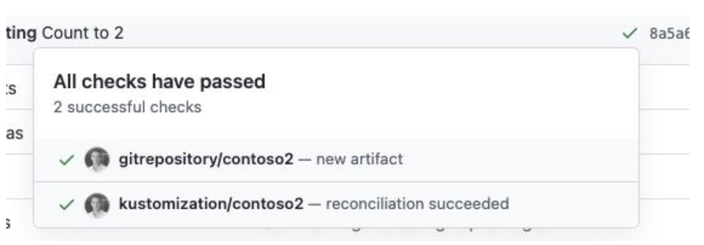
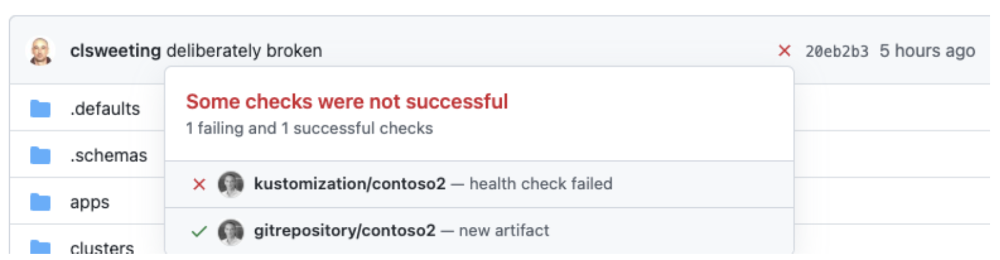

# Notification Provider

## Problem


##  Using Flux Notifications to report reconciliation status to the GitOps repo

[Flux Notifications](https://fluxcd.io/docs/guides/notifications/) can be used to send notifications based on events emitted when changes are made to the "GitOps repository" (i.e. the git repo watched by Flux).   These notifications can be sent to messaging channels (eg. Teams, Slack) via web-hooks, but can also be written back to the GitOps repo using [Git Commit Statuses](https://docs.github.com/en/rest/commits/statuses).

This document describes manually adding the Flux Notifications Provider to update the GitOps repository with information about the 'success' or 'failure' of a change to the repo, & the resulting Flux reconciliation.

Once implemented, you will see a green check-mark or red cross next to the commit hash in GitHub.  Hovering over the icon, you will be able to see a description of the status notifications:




Pre-requisites and assumptions:
- You already have a Kubernetes cluster set up
- You have GitOps/Flux configured to watch an Azure DevOps repo
- You have a GitHub/Azure DevOps Personal Access Token (PAT) with which you can write to the GitOps repo
- Kubectl & Flux command-line tools installed on your local environment


## Setting up the Notification Provider

In the following description, variables (which you can create as env vars) are defined as follows:

- `GPAT` : your GitHub/Azure DevOps PAT
- `USER` : username under which the GitOps repo lives on GitHub
- `REPO` : the name of the GitOps repo on GitHub / the URL of the GitOps repo on Azure DevOps

i.e. the GitOps repo on GitHub is https://github.com/USER/REPO.


1. Create a secret to store your GitHub/Azure DevOps PAT.  Here, we have chosen to name the secret "github-token"/"azdo-token":

    ```bash
    kubectl create secret generic github-token -n flux-system --from-literal=token=$GPAT
    ```
    or

    ```bash
    kubectl create secret generic azdo-token -n flux-system --from-literal=token=$GPAT
    ```

    If you wanted to verify/check the token on the cluster:

    ```bash
    kubectl get secrets/github-token -n flux-system -o json | jq -r '.data.token' | base64 -d
    ```

    or

    ```bash
    kubectl get secrets/azdo-token -n flux-system -o json | jq -r '.data.token' | base64 -d
    ```

    Note: Alternatively you can create a Secret via YAML as described in the [Notification Provider's authentication section](https://fluxcd.io/docs/components/notification/provider/#authentication); note that the token must first be base64 encoded.

<br>

2. Create the Flux Notification Provider and Alert.


   **a. If your GitOps repo is stored in Github:**

   Here, a Provider named "github-provider" is created in a file `provider.yaml`:

    ```yaml
    apiVersion: notification.toolkit.fluxcd.io/v1beta1
    kind: Provider
    metadata:
      name: github-provider
      namespace: flux-system
    spec:
      type: github
      address: https://github.com/$USER/$REPO   # e.g. https://github.com/simonjaeger/contoso2
      secretRef:
        name: github-token
    ```

   Here, an Alert named "github-alert" (which uses the above Provider) is created in a file `alert.yaml`:

    ```yaml
    apiVersion: notification.toolkit.fluxcd.io/v1beta1
    kind: Alert
    metadata:
      name: github-alert
      namespace: flux-system
    spec:
      providerRef:
        name: github-provider
      eventSeverity: info
      eventSources:
        - kind: Kustomization
          name: '*'
        - kind: GitRepository
          name: '*'
    ```


   **b. If your GitOps repo is stored in Azure DevOps:**


   In the Azure DevOps case, a Provider named "azdo-provider" is created in a file `provider.yaml`:

   ```yaml
    apiVersion: notification.toolkit.fluxcd.io/v1beta1
    kind: Provider
    metadata:
      name: azdo-provider
      namespace: flux-system
    spec:
      type: azuredevops
      address: $REPO
      secretRef:
        name: azdo-token
    ```

    An Alert called "azdo-alert" is created in a file `alert.yaml`:

    ```yaml
    apiVersion: notification.toolkit.fluxcd.io/v1beta1
    kind: Alert
    metadata:
      name: azdo-alert
      namespace: flux-system
    spec:
      providerRef:
        name: azdo-provider
      eventSeverity: info
      eventSources:
        - kind: Kustomization
          name: '*'
        - kind: GitRepository
          name: '*'
    ```


    Apply those files to your cluster.  (`kubectl apply -f provider.yaml` / `kubectl apply -f alert.yaml`)

    To check your providers and alerts:

    ```bash
    $ kubectl get providers -n flux-system
    $ kubectl get alerts -n flux-system
    ```
<br>

3. Verify that notifications are sent when changes are committed to the GitOps repo.

   i.e. make changes to your repo, and you should see the Commit Status updated (with a check or cross icon if viewing via the GitHub website).

   If you do not see any icons after a couple of minutes, see the Debugging information below.

<br>

4. Configure Flux to report Health Assessment

   The Notifications Alert looks for Kustomization events, and reports whether the Kustomization is valid. Without [health assesment](https://fluxcd.io/flux/components/kustomize/kustomization/#health-assessment) configured, this will only tell you whether the Kustomization builds and the YAML manifests are valid. It does not concern itself with whether the actual container images are running.

    To enabled health checking for all the reconciled resources, set `spec.wait` and `spec.timeout`:

    ```yaml
    apiVersion: kustomize.toolkit.fluxcd.io/v1beta2
    kind: Kustomization
    metadata:
      name: contoso2
      namespace: flux-system
    spec:
      interval: 30s
      path: ./clusters/seattle/sets/prod
      prune: true
      sourceRef:
        kind: GitRepository
        name: contoso2
      targetNamespace: default
      wait: true
      timeout: 2m
    ```

    If you wish to select only certain resources, list them under `spec.healthChecks`. More details can be found on that under the [Flux Kustomize Health Assassment docs](https://fluxcd.io/flux/components/kustomize/kustomization/#health-assessment)


<br>

5. Verify that health assessment work.

   Try referencing a non-existent image in your Kubernetes manifests. The failed health checks should be reflected in the commit status:





<br>

<hr>

# Debugging tips

## Flux log

Use the `flux logs` command, using the `--kind` and `--name` options to filter:

`flux logs --kind=AlertProvider --name=github-provider -A`

`flux logs --kind=Alert --name=github-alert -A`

If the commands time out regularly, try adding the `--since` option.


## Exploring Commit Statuses via the Github API

To access the raw Git Commit Status, you can use the [GitHub API](https://docs.github.com/en/rest/commits/statuses)

```bash
curl -i https://api.github.com/repos/$GITHUB_USER/$REPO/commits/$COMMIT/statuses
```

You can add the `-u` option with your GitHub user and PAT in order to increase the quota (from 60 to 5000 requests per hour); it's also a useful way to verify your PAT is valid. For example:

```bash
curl -i -u "$GITHUB_USER:$GITHUB_PAT" https://api.github.com/repos/$GITHUB_USER/$REPO/commits/$COMMIT/statuses
```

Note that the Commit Statuses are stored in a list.

Example output (extraneous fields about the creator and node ID have been removed for clarity):

```json
[
  {
    ....
    "state": "success",
    "description": "reconciliation succeeded",
    "target_url": null,
    "context": "kustomization/contoso2",
    "created_at": "2022-07-21T09:17:29Z",
    "updated_at": "2022-07-21T09:17:29Z",
    "creator": {
       ....
    }
  },
  {
    ....
    "state": "success",
    "description": "new artifact",
    "target_url": null,
    "context": "gitrepository/contoso2",
    "created_at": "2022-07-21T09:17:28Z",
    "updated_at": "2022-07-21T09:17:28Z",
    "creator": {
       ....
    }
  }
]
```

