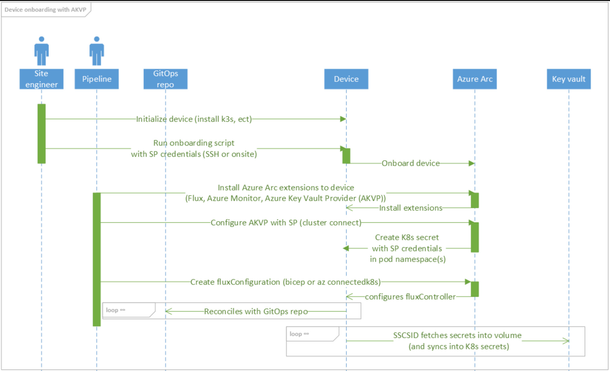
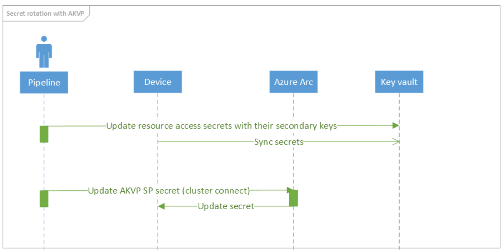
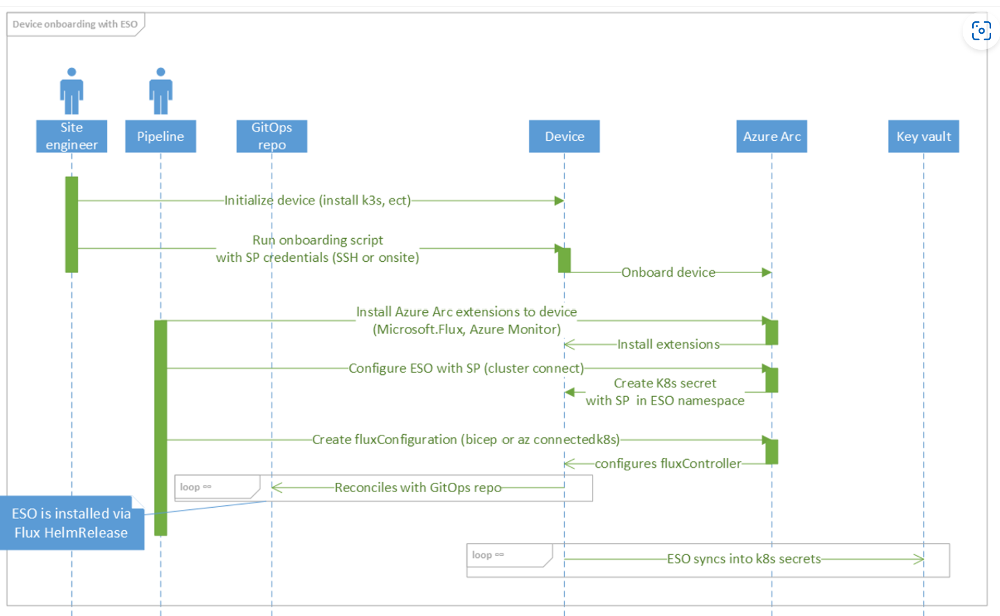
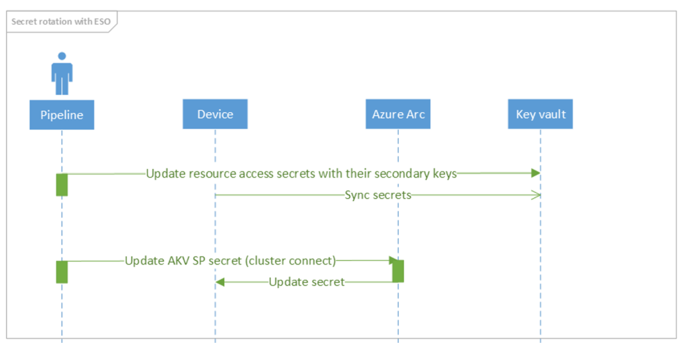
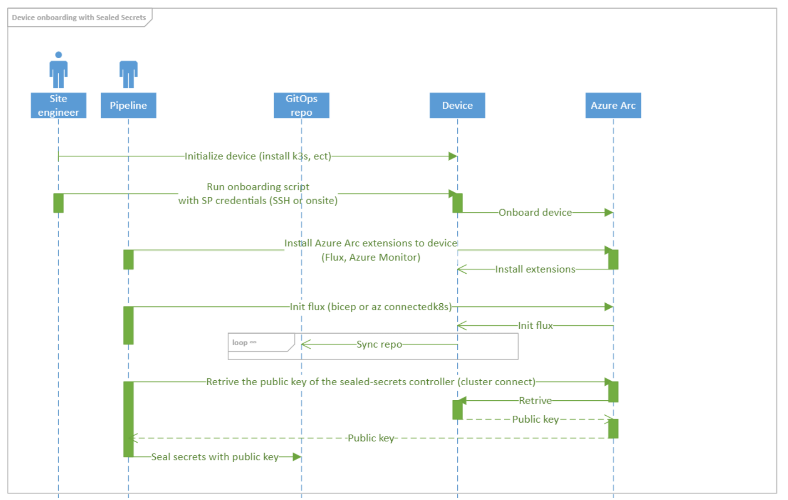
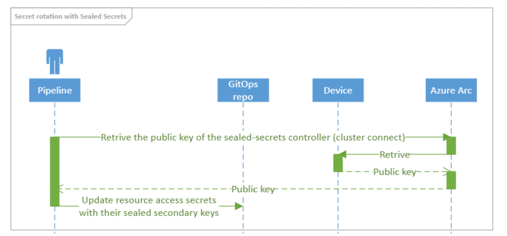

# Managing secrets in Kubernetes clusters

## Context

We operate multiple K8s clusters on the edge that require communication with cloud resources, such as an container registries or cloud storage. Secrets will therefore need to be created, managed & deployed to the clusters in order to access the cloud resources.

In this document, we shall consider some of the options available, their strengths & weaknesses, and our recommendation.


## Decision drivers:

- **Ease of use**: How easy is it to add and use a new secret?
- **Secret rotation**: Can secret rotation be done, if yes is it difficult?
- **Security**: How secure is it?
- **Accountability**: How easy is it to see what was changed?
- **Offline capabilities**: Can pods be started or restarted while the cluster is offline?
- **Software popularity and support**: Is the approach recommended by a company and how popular is the product with the OSS community?

## Options considered:

### 1. [Secrets Store CSI Driver with an Azure Key Vault Provider](https://github.com/Azure/secrets-store-csi-driver-provider-azure)

Azure Key Vault Provider for [Secrets Store CSI Driver](https://github.com/kubernetes-sigs/secrets-store-csi-driver) allows you to get secret contents stored in an [Azure Key Vault](https://docs.microsoft.com/en-us/azure/key-vault/general/overview) instance and use the Secrets Store CSI driver interface to mount them into Kubernetes pods.



**Advantages:**

- Supports sync with Kubernetes Secrets
- Supports auto rotation of secrets with customizable sync intervals per cluster.
- Secrets are not stored in the repository
- Supports Prometheus metrics for observerabilty.
- Seems to be the MSFT choice (secrets-store-csi-driver is heavly contributed by [MSFT](https://github.com/kubernetes-sigs/secrets-store-csi-driver) and Kubernetes-SIG)

**Disadvantages:**

- AKVP can only access KV from a non-Azure environment using a [Service Principal](https://azure.github.io/secrets-store-csi-driver-provider-azure/docs/configurations/identity-access-modes/service-principal-mode/#configure-service-principal-to-access-keyvault). The SP credentials must be created as a Kubernetes secret.
  > For potential solutions for how to create the SP see [the appendix](#potential-solutions-for-how-to-create-the-sp-needed-for-the-eso/akvp).
- The [Kubernetes Secret containing the Service Principal credentials](https://azure.github.io/secrets-store-csi-driver-provider-azure/docs/configurations/identity-access-modes/service-principal-mode/) need to be created in the same namespace as the application pod. If pods in multiple namespaces need to use the same SP to access Key Vault, this Kubernetes Secret needs to be created in each namespace.
- The GitOps repo must contain the name of the key vault within the SecretProviderClass
- Must mount secrets as volumes to allow sync into Kubernetes Secrets
- Missing Offline scenario support: When the edge is offline the SSCSID fails to fetch the secret and thus mounting the volume fails, making scaling and restarting pods not possible while being offline (see [PG proposal here](https://docs.google.com/document/d/1qAm_D3UflpmSn7J8QV1gxvbmv5RDX6hw8v2mvYfKBfc/edit#)). **TODO - confirm with PG what's the fix.**
- Uses more resources (4 pods; CSI Storage driver and provider) and is a daemonset - not test on RPS / resource usage.

### 2. [External Secrets Operator with Azure Key Vault](https://external-secrets.io/)

The External Secrets Operator (ESO) is an open-sourced Kubernetes operator that can read secrets from external secret stores (e.g., Azure Key Vault) and sync those into Kubernetes Secrets. In contrast to the AKVP it relies on a k8s controller and CRDs instead of the secret store CSI driver.



**Advantanges**

- Supports sync with Kubernetes Secrets.
- Supports auto rotation of secrets with customizable sync intervals per secret.
- Components are split into different CRDs for namespace (ExternalSecret, SecretStore) and cluster-wide (ClusterSecretStore, ClusterExternalSecret) making syncing more manageable i.r.t. different deployments/pods etc.
- Secrets are not stored in the GitOps Repository.
- Supports Prometheus metrics for observability.
- Service Principal secret for the (Cluster)SecretStores could placed in a namespaced that only the ESO can access (see [Shared ClusterSecretStore](https://external-secrets.io/v0.5.2/guides-multi-tenancy/)).
- Resource efficient (single pod) - not test on RPS / resource usage.
- Open source and higher contributions, but seems not to be MSFT focus ([GitHub](https://github.com/external-secrets/external-secrets))
- Mounting Secrets as volumes is supported via K8S's APIs (see [here](https://kubernetes.io/docs/concepts/configuration/secret/#using-secrets-as-files-from-a-pod))
- Slightly more popular OSS repository with 1.5k stars vs ~850 + ~350 stars (AKVP)
- Offline scenario support: As ESO is using native K8s secrets the cluster can be offline, and it does not have any implications towards restarting and scaling pods while being offline.

**Disadvantages**
- ESO requires a Service Principal or Self-managed Workload Identity (see Appendix [Workload Identity](#Azure-AD-Workload-Identity))
  > For potential solutions for how to create the SP see [the appendix](#potential-solutions-for-how-to-create-the-sp-needed-for-the-eso/akvp).
- The GitOps repo must contain the name of the keyvault within the SecretStore / ClusterSecretStore


### 3. [Sealed Secrets with Flux](https://fluxcd.io/docs/guides/sealed-secrets/)

In order to store secrets safely in a public or private Git repository, you can use Bitnami’s sealed-secrets controller and encrypt your Kubernetes Secrets into SealedSecrets. The sealed secrets can be decrypted only by the controller running in your cluster and nobody else can obtain the original secret, even if they have access to the Git repository.



**Advantages:**
- Secret changes are managed by making changes within the GitOps repository which provides great traceability of the changes made
- All secrets can be rotated by making changes in GitOps, without accessing the cluster
- [Sealing key is renewed automatically](https://github.com/bitnami-labs/sealed-secrets#sealing-key-renewal) every 30 days

**Disadvantages:**
- To encrypt secrets you must retrieve the public key of the `sealed-secrets controller` deployed onto the cluster
- Secrets are stored encrypted in the gitops repository, if the private encryption key is leaked, all secrets can be decrypted
- Due to [automatic renewal of the sealing key](https://github.com/bitnami-labs/sealed-secrets#sealing-key-renewal), the key needs to be prefetched from the cluster or cluster set up to store the sealing key on renewal in a secondary location


### 4. [Hashicorp Vault](https://www.vaultproject.io/docs/platform/k8s)

Vault can be deployed into Kubernetes using the official HashiCorp Vault Helm chart. The Helm chart allows users to deploy Vault in various configurations:

- Dev: a single in-memory Vault server for testing Vault
- Standalone (default): a single Vault server persisting to a volume using the file storage backend
  > Would require an additional solution for rotating secrets, adding secrets and restoring secrets and is not highly available.
- High-Availability (HA): a cluster of Vault servers that use an HA storage backend such as Consul (default)
  > An alternative to using Sealed Secrets with Gitea for offline scenarios
- External: a Vault Agent Injector server that depends on an external Vault server
  > An equivalent alternative to using Azure Key vault with ESO or CSI driver

## Decision

[What decision was taken?]: #

We propose to use the **_External Secret Operator (ESO)_** as it:
- fulfils all major requirements,
- is well supported by the Opensource community,
- supports (temporary) offline scenarios as it syncs into K8s secrets,
- allows easy management of K8s secrets with secret rotation.

In addition we also recommend:
- Creating the Azure Key Vault SP secret on the cluster with Cluster Connect
- Using the `ImagePullSecrets` functionality and define this as a default on a `ServiceAccountLevel`. We can still use the mirror-functionality of k3s in the `registry.yaml` **TODO: Look into using kustomize to template the ACR url**
  > See [Secret Rotation for Authenticated Private Container Registry](#Secret-Rotation-for-Authenticated-Private-Container-Registry) for consequences of using option 2
- Mounting secrets as environment variables and using [Reloader](https://github.com/stakater/Reloader) to restart the applications (unless not restarting applications is a requirement)

A switching to CSI Driver (if required) seems feasible. For example, if based on additional requirements, we switch offline support to sealed secrets.

## Consequences

[What are the consequences of this decision?]: #

- Secrets are managed in central location (Azure)
- Secrets can be rotated via Keyvault and synced into the secrets (environment or volume)
  > Important: see important implications in [Appendix - Secrets Rotation on Environment Variables and Mounted Secrets](#Secrets-Rotation-on-Environment-Variables-and-Mounted-Secrets)
- We need to create one secret on the cluster for ESO to authenticate with Azure
- We need to decide how to authenticate the ACR (private container registry) regarding secret rotation.
- With using Cluster Connect for creating of the SP there needs to be additional steps to ensure traceability of changing/creating the secret on the cluster
- We need to account for rate limits of the KV [docs](https://docs.microsoft.com/en-us/azure/key-vault/general/service-limits) and choose appropriate sync intervals.

 ## Appendix

### Secrets Rotation on Environment Variables and Mounted Secrets

1. Mapping Secrets via secretKeyRef with environment variables.

   If we map a K8s native secret via a `secretKeyRef` into an environment variable and we rotate keys the environment variable is not updated even though the K8s native secret has been updated. We need to restart the Pod so changes get populated. [Reloader](https://github.com/stakater/Reloader) solves this issue with a K8S controller.
   ```yaml
   ...
        env:
            - name: EVENTHUB_CONNECTION_STRING
              valueFrom:
                secretKeyRef:
                  name: poc-creds
                  key: EventhubConnectionString
   ...
   ```

2. Mapping Secrets via volumeMounts (ESO way)

   If we map a K8s native secret via a volume mount and we rotate keys the file gets updated. The application needs to then be able pick up the changes without a restart (requiring most likely custom logic in the application to support this). Then no restart of the application is required.

   ```yaml
   ...
        volumeMounts:
        - name: mounted-secret
          mountPath: /mnt/secrets-store
          readOnly: true
      volumes:
      - name: mounted-secret
        secret:
          secretName: poc-creds
   ...
   ```

3. Mapping Secrets via volumeMounts (AKVP SSCSID way)

   SSCSID focuses on mounting external secrets into the CSI. Thus if we rotate keys the file gets updated. The application needs to then be able pick up the changes without a restart (requiring most likely custom logic in the application to support this). Then no restart of the application is required.

   ```yaml
   ...
        volumeMounts:
        - name: app-secrets-store-inline
          mountPath: "/mnt/app-secrets-store"
          readOnly: true
      volumes:
      - name: app-secrets-store-inline
        csi:
          driver: secrets-store.csi.k8s.io
          readOnly: true
          volumeAttributes:
            secretProviderClass: akvp-app
          nodePublishSecretRef:
            name: secrets-store-sp-creds
   ...
   ```

### Product Group Links provided for AKVP with SSCSID

1. Differences between ESO / SSCSID ([GitHub Issue](https://github.com/external-secrets/external-secrets/issues/478))
2. Secrets Management on K8S talk [here](https://www.youtube.com/watch?v=EW25WpErCmA) (Native Secrets, Vault.io, and ESO vs. SSCSID)

### Secret Rotation for Authenticated Private Container Registry

We need to decide how we authenticate the private container registries (e.g., ACR).
With k3s we have two options:
1.  Use `/etc/rancher/k3s/registries.yaml` to cluster-wide authenticate the CR. We have the following disadvantages:
    - You need to have access to the machine locally or with SSH (cluster connect is not good enough) to modify the `/etc/rancher/k3s/registries.yaml`.
    -  In order for the registry changes in `/etc/rancher/k3s/registries.yaml` to take effect, you need to restart K3s on each node
2.  Use a `dockerconfigjson` Kubernetes Secret on Pod-Level with `ImagePullSecret` (This can be also defined on [namespace-level](https://kubernetes.io/docs/concepts/containers/images/#referring-to-an-imagepullsecrets-on-a-pod)). We have the following disadvantages:
    - Need to specify the ImagePullSecret for each pod that uses a private CR. We can still use the mirror feature of `/etc/rancher/k3s/registries.yaml` or explicitly name the CR.

### Potential solutions for how to create the SP needed for the ESO/AKVP

- Using Cluster Connect
   Using [Cluster Connect](https://docs.microsoft.com/en-us/azure/azure-arc/kubernetes/cluster-connect?tabs=azure-cli) to connect to the cluster and create the SP secret within the cluster

  **Advantages:**
    - Cluster connect is also useful as an alternative to manage the cluster without SSH (only cluster, not the device)

  **Disadvantages:**
    - Lack of traceability without additional steps, such as only running this from a pipeline
- Using Sealed Secrets to create the secrets within the GitOps repo
  > See advantages and disadvantages of Sealed Secrets above

### Azure AD Workload Identity

[Azure AD Workload Identity](https://azure.github.io/azure-workload-identity/docs/) for Kubernetes integrates with the capabilities native to Kubernetes to federate with external identity providers.

**Disadvantages:**

- Would require us to set up our own OIDC url and manage and rotate the secret: [Self-Managed Clusters - Azure AD Workload Identity](https://azure.github.io/azure-workload-identity/docs/installation/self-managed-clusters.html)

